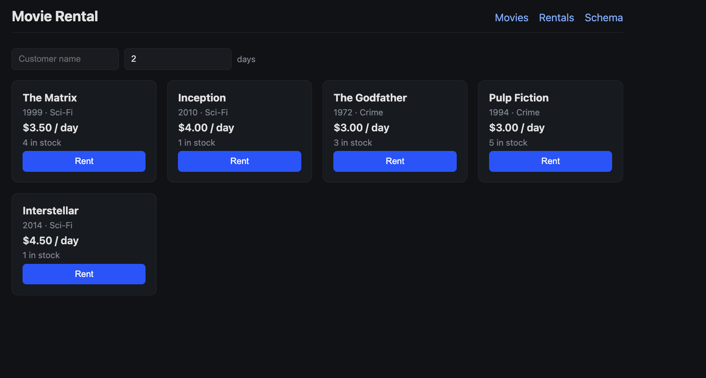
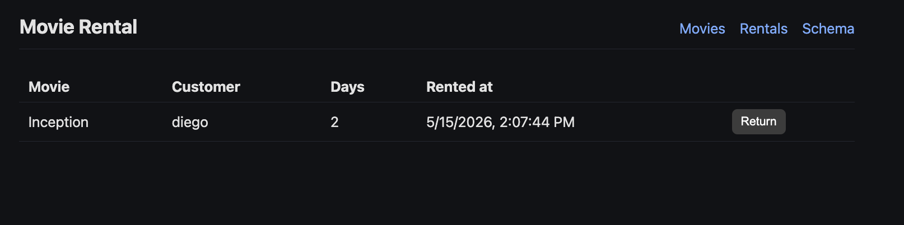
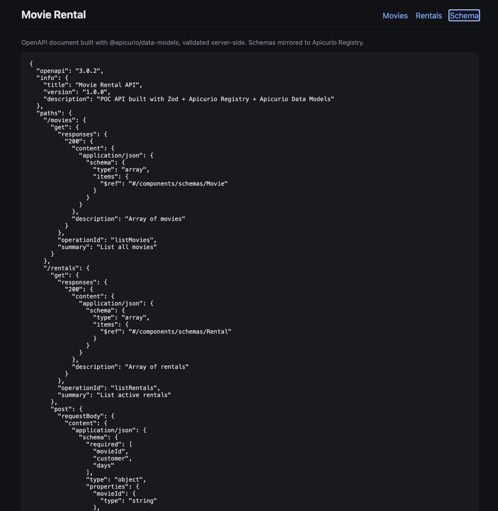
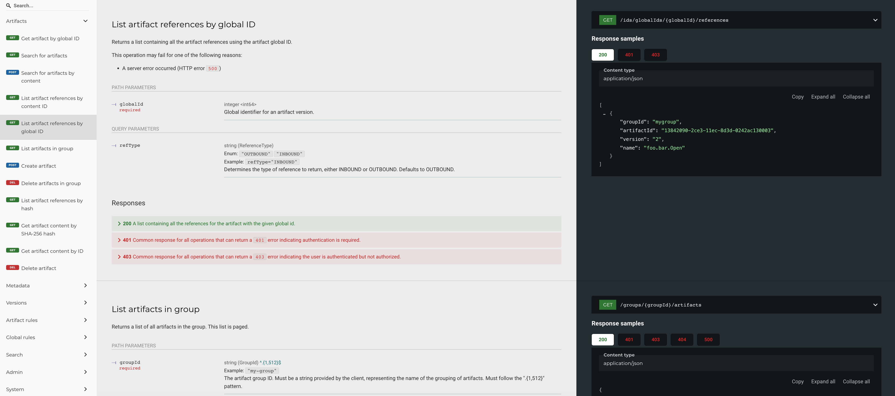

# apicurio-poc

A small proof of concept exploring [Apicurio Registry](https://www.apicurio.io/) for managing API schemas (OpenAPI) alongside a Node.js backend and a React frontend.

## Stack

- **Apicurio Registry** + **Apicurio Registry UI** (latest-release, backed by PostgreSQL 17)
- **Backend**: Node.js, Express, Zod, `@apicurio/data-models`
- **Frontend**: React 18, Vite, TanStack Query, TanStack Router
- **Runtime**: podman / podman-compose

## Endpoints

| Service | URL |
| --- | --- |
| Frontend | http://localhost:5173 |
| Backend API | http://localhost:3001 |
| Apicurio Registry UI | http://localhost:8888 |
| Apicurio Registry API | http://localhost:8080/apis/registry/v3 |

## Run

```bash
./run.sh
./test.sh
./stop.sh
```

## Screenshots

### Apicurio Registry UI — artifacts list


### Apicurio Registry UI — artifact detail


### Apicurio Registry UI — schema view


### Application schema rendering

