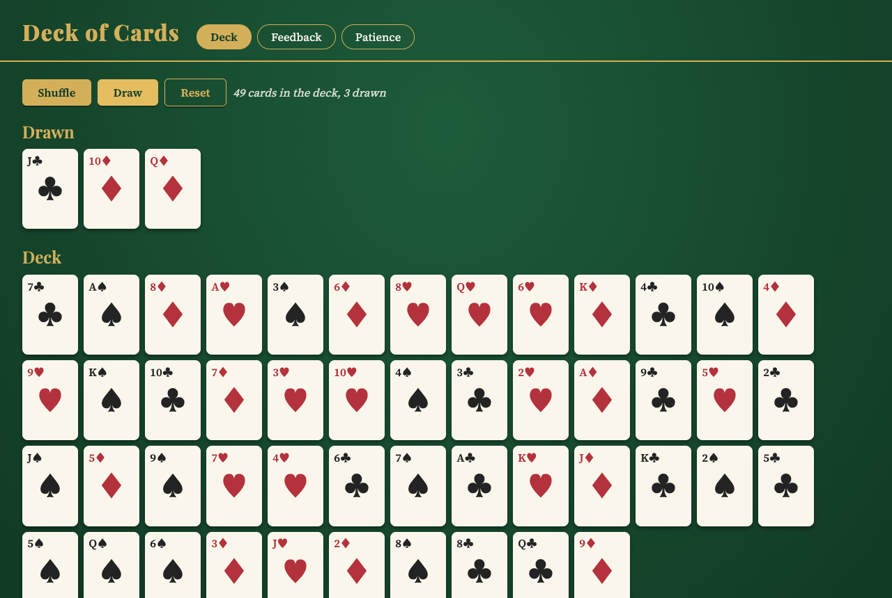
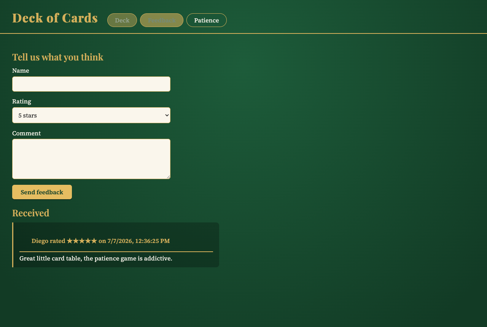
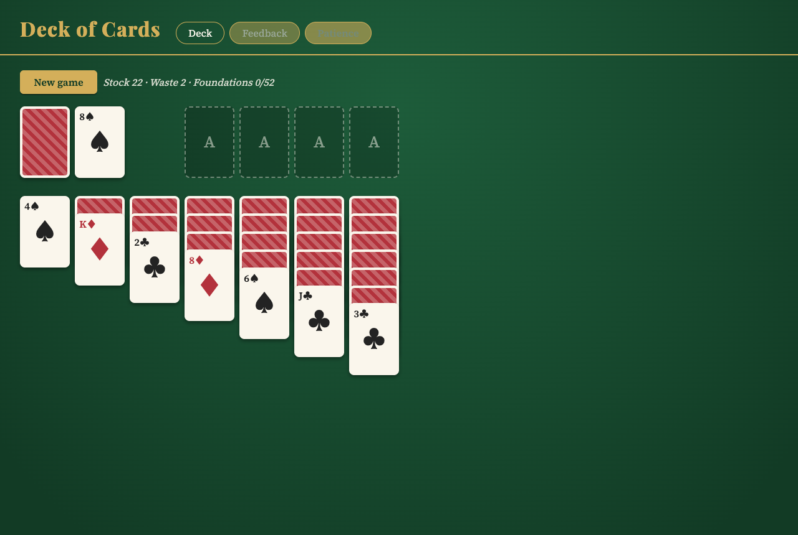

# Deck of Cards

A deck of cards application built with Astro 7, TypeScript 6 and Node.js. No frameworks, no runtime libraries, just vanilla TypeScript on a felt table.

## Stack

- Astro 7.0.6
- TypeScript 6.0.3
- Node.js 24

## Run

```bash
./start.sh
```

The app runs at http://127.0.0.1:4600

```bash
./stop.sh
```

## Tabs

### Deck

A full 52-card deck you can shuffle, draw from and reset. Drawn cards pile up on top and the status line tracks how many cards remain.



### Feedback

A form to rate the app from 1 to 5 stars and leave a comment. Entries are stored in the browser localStorage and listed below the form.



### Patience

Klondike patience played entirely with clicks. Click the stock to draw to the waste, click a face-up card to select it, then click a destination to move it. Tableau piles build down in alternating colors, foundations build up by suit from the ace, and empty columns take a king. Move all 52 cards to the foundations to win.



## Layout

- `src/cards.ts` deck model shared by every tab
- `src/patience.ts` game rules, pure and UI-free
- `src/deck-ui.ts`, `src/feedback-ui.ts`, `src/patience-ui.ts` one module per tab
- `src/pages/index.astro` single page with the three tabs
