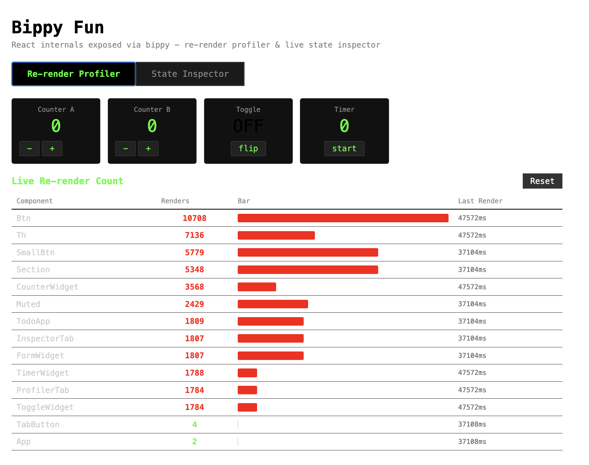
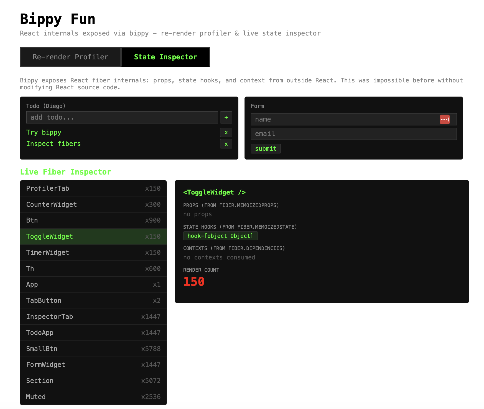

### Result

Bippy POC using React 19 with two tabs:





**Tab 1 - Re-render Profiler**: Uses bippy to hook into React's fiber commit lifecycle via `instrument()` and `traverseRenderedFibers()`. Counts every re-render per component in real-time with color-coded heat bars (green/yellow/red). Highlights DOM elements with a green outline flash on each render. Includes interactive widgets (counters, toggle, auto-timer) to trigger renders. This kind of per-component render counting from outside React was not possible before bippy.

**Tab 2 - State Inspector**: Uses bippy's `traverseProps()`, `traverseState()`, and `traverseContexts()` to read fiber internals from outside React. Select any component to see its live props, state hook count, consumed contexts, and render count. Includes a todo app (with useReducer + useContext) and a form widget to generate rich fiber data. Before bippy, inspecting component state/props/context without modifying source code or using React DevTools extension was not possible.

Bippy works by pretending to be React DevTools via `window.__REACT_DEVTOOLS_GLOBAL_HOOK__`, giving programmatic access to React's fiber tree without any React code changes.

### How to run
```bash
./run.sh
```
