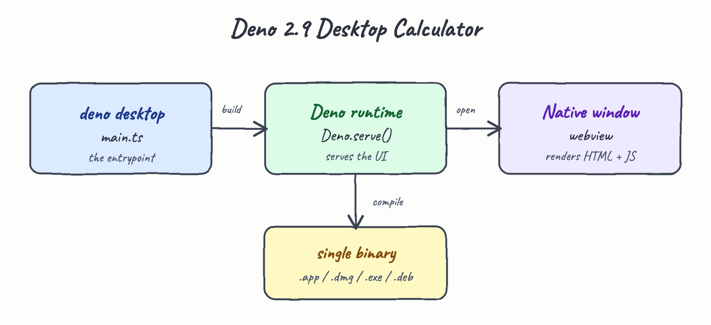
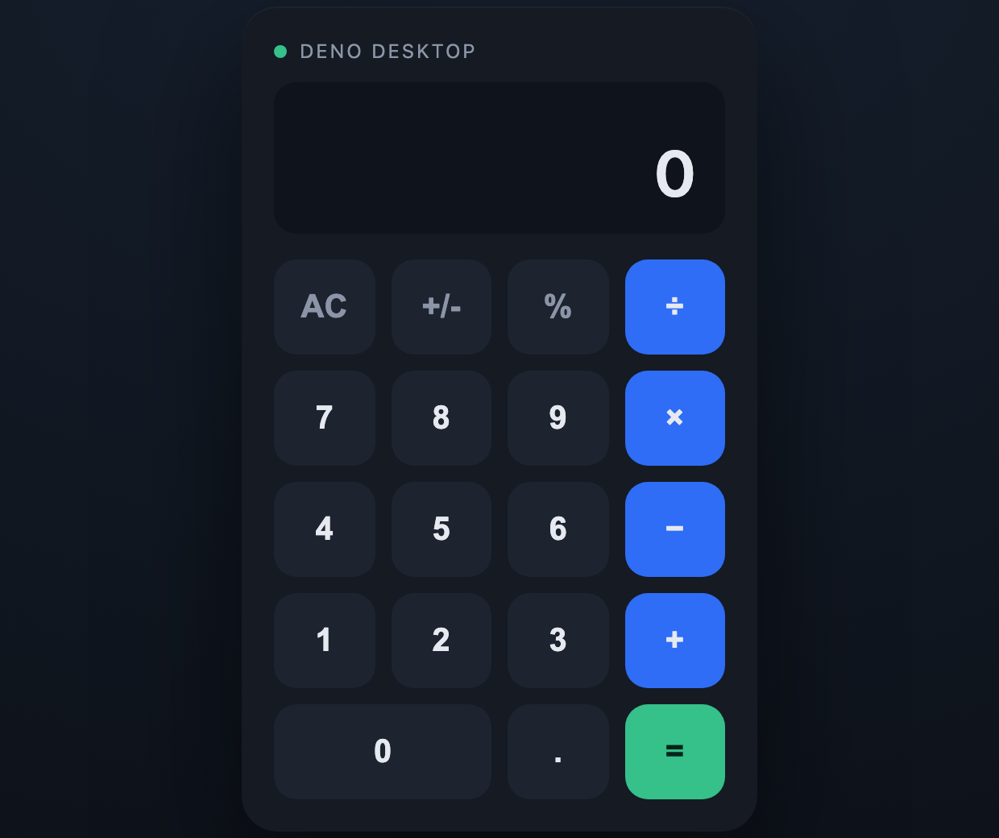
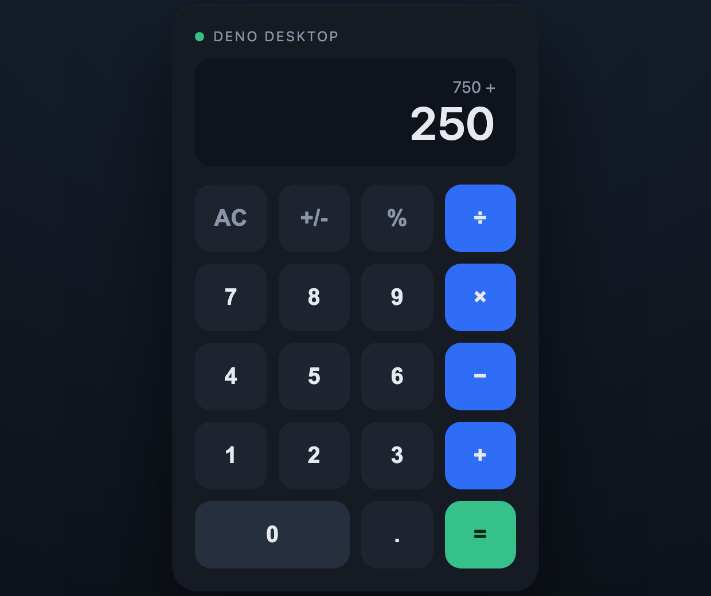
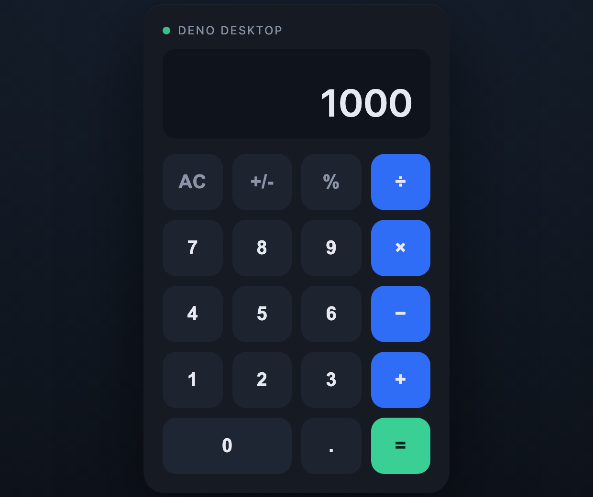

# Deno 2.9 Desktop Calculator

A native desktop calculator built with [`deno desktop`](https://deno.com/blog/v2.9#deno-desktop), the feature introduced in Deno 2.9.

The whole app is a single entrypoint, `main.ts`. The UI (HTML + CSS + JS) is served by `Deno.serve()`, which inside a desktop entrypoint automatically binds to the port the webview opens. Running `deno desktop main.ts` type-checks the script, compiles it to a `.dylib`, downloads the `laufey` webview backend, codesigns the bundle, and opens a native window rendering the calculator. The same machinery can compile the app to a single distributable binary.

## Architecture



## The app

| Idle | Mid-expression | Result |
| --- | --- | --- |
|  |  |  |

The calculator supports `+`, `-`, `×`, `÷`, `=`, `AC`, `+/-`, `%`, decimals, and the keyboard (digits, operators, `Enter`, `Escape`, `Backspace`). The mid-expression screenshot shows the history line (`750 +`) above the live value, and the result of `750 + 250 = 1000`.

## Requirements

- Deno **2.9 or newer** (`deno desktop` is experimental in 2.9).

```
deno --version
deno upgrade
```

## Run

```
./start.sh
```

`start.sh` checks the Deno version, then runs `deno desktop main.ts` and records the process id in `.desktop.pid`.

```
./stop.sh
```

`stop.sh` stops the running app.

You can also use the Deno tasks directly:

```
deno task desktop   # deno desktop main.ts
deno task dev       # deno desktop --hmr main.ts (Hot Module Replacement)
deno task build     # deno desktop --output Calculator.app main.ts
```

## Build a distributable binary

`deno desktop` builds a self-contained binary; the format follows the `--output` extension:

```
deno desktop --output Calculator.dmg main.ts                 # build for this machine
deno desktop --target x86_64-pc-windows-msvc main.ts         # cross-compile to Windows
deno desktop --all-targets main.ts                           # build every supported target
```

Supported targets: Linux x64/arm64, Windows x64, macOS x64/arm64.

## Files

| File | Purpose |
| --- | --- |
| `main.ts` | Desktop entrypoint: serves the calculator UI via `Deno.serve()`. |
| `deno.json` | `desktop`, `dev`, and `build` tasks. |
| `start.sh` / `stop.sh` | Start and stop the desktop app. |
| `printscreens/` | Architecture diagram and UI screenshots. |
