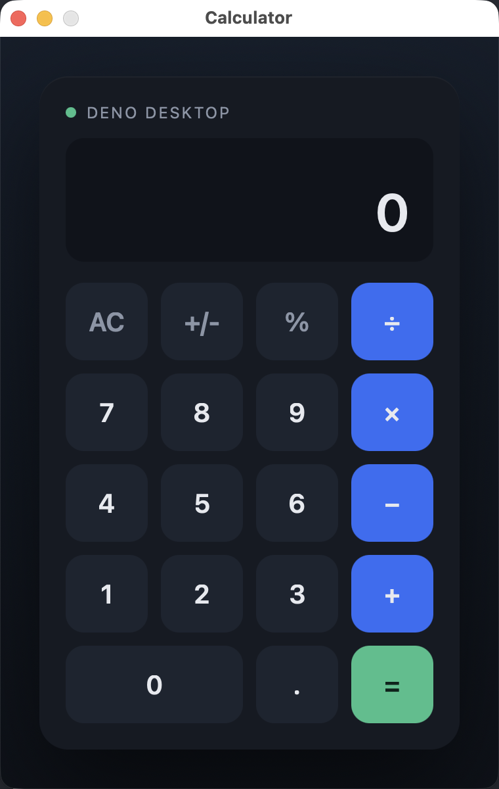

# Deno 2.9 Desktop Calculator

A native desktop calculator built with [`deno desktop`](https://deno.com/blog/v2.9#deno-desktop), the feature introduced in Deno 2.9.

The whole app is a single entrypoint, `main.ts`. The UI (HTML + CSS + JS) is served by `Deno.serve()`, which inside a desktop entrypoint automatically binds to the port the webview opens. `main.ts` then adopts the native window through `Deno.BrowserWindow` to set the title, fit the window to the calculator, and quit the process when the window is closed.

## The app



The real macOS window (note the traffic-light buttons): a `380x600` window titled "Calculator", rendered by Deno's webview backend.

| Mid-expression | Result |
| --- | --- |
|  |  |

It supports `+`, `-`, `×`, `÷`, `=`, `AC`, `+/-`, `%`, decimals, and the keyboard (digits, operators, `Enter`, `Escape`, `Backspace`). The left screenshot shows the history line (`750 +`) above the live value, and the right shows `750 + 250 = 1000`.

## Architecture


## Requirements

- Deno **2.9 or newer** (`deno desktop` is experimental in 2.9).

```
deno --version
deno upgrade
```

## Run

```
./start.sh
```

`start.sh` checks the Deno version, builds `Calculator.app`, and opens it. It rebuilds only when `main.ts` is newer than the existing bundle.

```
./stop.sh
```

`stop.sh` quits the running app. Closing the window (red button) also quits it: `main.ts` listens for the window `close` event and calls `Deno.exit(0)`.

You can also use the Deno tasks:

```
deno task build   # deno desktop --allow-net --output Calculator.app main.ts
deno task dev     # deno desktop --hmr --allow-net main.ts (Hot Module Replacement)
```

## How it works

`deno desktop main.ts` does not run the app; it **builds** a self-contained bundle (`deno-2.app` by default, or whatever you pass to `--output`). You then launch that bundle. `start.sh` uses `--output Calculator.app` and `open`s it.

The bundle needs its permissions baked in at build time. `Deno.serve()` requires network access, so the build passes `--allow-net`; without it the launched app cannot serve its own UI and exits on startup.

```ts
Deno.serve(() =>
  new Response(html, { headers: { "content-type": "text/html; charset=utf-8" } })
);

const win = new Deno.BrowserWindow({
  title: "Calculator",
  width: 380,
  height: 600,
  resizable: false,
});

win.addEventListener("close", () => {
  Deno.exit(0);
});
```

## Build a distributable binary

`deno desktop` builds a self-contained binary; the format follows the `--output` extension:

```
deno desktop --allow-net --output Calculator.dmg main.ts              # build for this machine
deno desktop --allow-net --target x86_64-pc-windows-msvc main.ts      # cross-compile to Windows
deno desktop --allow-net --all-targets main.ts                       # build every supported target
```

Supported targets: Linux x64/arm64, Windows x64, macOS x64/arm64.

## Files

| File | Purpose |
| --- | --- |
| `main.ts` | Desktop entrypoint: serves the UI via `Deno.serve()`, sizes the window, quits on close. |
| `deno.json` | `build` and `dev` tasks. |
| `start.sh` / `stop.sh` | Build + open the app, and quit it. |
| `printscreens/` | Architecture diagram and UI screenshots. |
