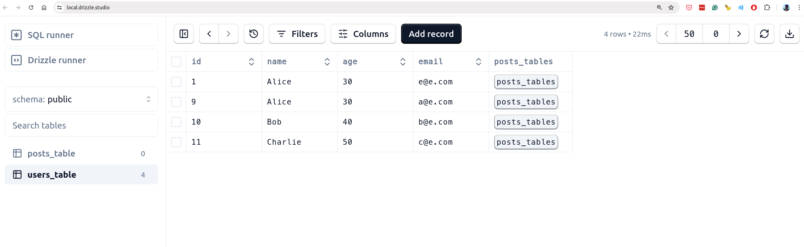

### Run Postgres
```
./run-postgres.sh
./run-pg-admin.sh
./import-schema.sh
```
```
❯ docker ps
CONTAINER ID   IMAGE            COMMAND                  CREATED       STATUS       PORTS                                            NAMES
45a56524cddf   dpage/pgadmin4   "/entrypoint.sh"         3 hours ago   Up 3 hours   443/tcp, 0.0.0.0:5051->80/tcp, :::5051->80/tcp   pgadmin-root
84609f630536   postgres         "docker-entrypoint.s…"   3 hours ago   Up 3 hours   0.0.0.0:5432->5432/tcp, :::5432->5432/tcp        postgresql
```

### Run Drizzle
```
npm run generate
npm run migrate
npm run run
```
```
❯ npm run run

> drizzle-orm-bad@1.0.0 run
> ts-node index.ts

[ { id: 1, name: 'Alice', age: 30, email: 'e@e.com' } ]
[
  { id: 1, name: 'Alice', age: 30, email: 'e@e.com' },
  { id: 9, name: 'Alice', age: 30, email: 'a@e.com' },
  { id: 10, name: 'Bob', age: 40, email: 'b@e.com' },
  { id: 11, name: 'Charlie', age: 50, email: 'c@e.com' }
]
```
```
./studio.sh
```
https://local.drizzle.studio/

