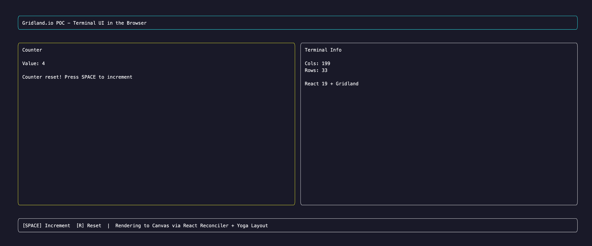

# Gridland.io POC

Terminal UI rendered in the browser using Gridland.io framework.
Gridland uses a React reconciler to render components onto an HTML5 Canvas via the Yoga layout engine, no terminal emulator needed.

## Result



## Stack

* Node.js 24
* React 19
* TypeScript
* Vite
* @gridland/web (Canvas renderer + React integration)
* @gridland/utils (Keyboard hooks, terminal dimensions)

## What it does

* Renders a TUI (Terminal User Interface) directly in the browser canvas
* Interactive counter controlled by keyboard (SPACE to increment, R to reset)
* Shows terminal dimensions (cols/rows) in real time
* Layout uses Yoga (flexbox) with border, padding, and color support
* All rendering goes through a custom React reconciler, not the DOM

## How to run

```
chmod +x run.sh
./run.sh
```

Or manually:
```
npm install
npx vite --open
```

Opens on http://localhost:5173

## How it works

Gridland replaces the standard React DOM renderer with a custom reconciler that targets an HTML5 Canvas.
The `<TUI>` component creates the canvas and renderer.
Inside `<TUI>`, you use `<box>` and `<text>` elements (not HTML) which are laid out by the Yoga engine and painted as terminal-style cells on the canvas.

Hooks like `useKeyboard` and `useTerminalDimensions` from `@gridland/utils` provide input handling and responsive sizing.
