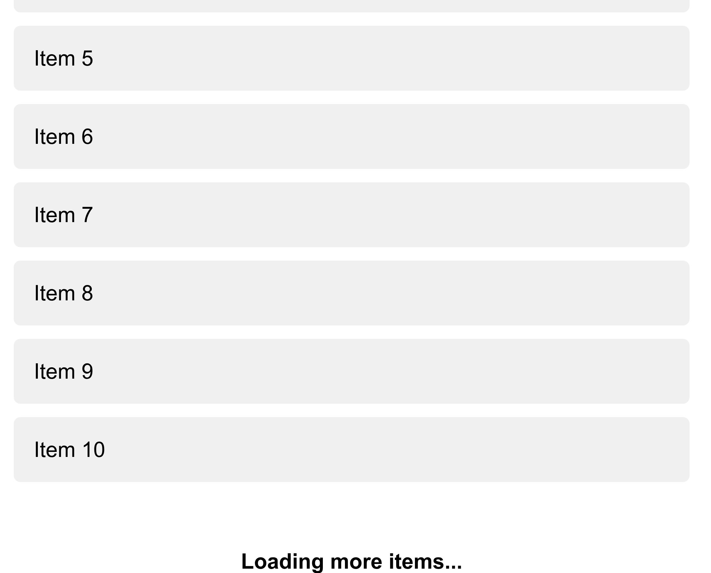

# Infinite Scroll

Simple infinite scroll implementation using Javascript.

## How it works

1. There is a window event listener for scroll events.
```js
 window.addEventListener("scroll", () => { ... });
```
2. There is a math that calculates the distance from the bottom of the page.
```js
  function isNearBottom() {
    return window.innerHeight + window.scrollY >= document.body.offsetHeight - 100;
  }
```
3. When the distance is less than 100px, it fetches more content.
```js
  window.addEventListener("scroll", () => {
    if (!loadingInProgress && isNearBottom()) {
      loadMoreItems();
    }
  });
```
4. The new content is appended to the existing content.
```js
 function loadMoreItems(count = 10) { ... }
```
5. The process repeats as the user scrolls down.

## Result



### Trade-offs: Infinite Scroll

* Advantages of Infinite Scroll
  - High engagement.
  - Mobile-friendly.
  - Faster initial loads.
  - Great for feeds/galleries.
* Disadvantages of Infinite Scroll
  - Poor navigation context.
  - Footer inaccessible.
  - Performance/memory risks.

### Options

1. Scroll Event Listeners (implemented here)
2. Intersection Observer API 
3. Virtualized Lists (Windowing)
4. Hybrid

### Trade-offs: Options

* Scroll Event Listeners
  - Works by attaching a scroll handler and checking position.
  - **Pros:** Broad compatibility, fine control, simple.
  - **Cons:** Frequent firing, manual calculations, poor performance without throttling.
* Intersection Observer API
  - Uses browser API to detect when an element is visible.
  - **Pros:** High performance, simple code, avoids layout thrashing.
  - **Cons:** Not in legacy browsers, less pixel-precise.
* Virtualized Lists
  - Only renders visible DOM items (e.g., with react-window).
  - **Pros:** Best performance for huge lists, low memory use.
  - **Cons:** Complex to implement, tricky with variable height items.
* Hybrid Approach
  - Mix of auto-scroll and manual "Load More" or pagination URLs.
  - **Pros:** SEO-friendly, accessible, better footer visibility.
  - **Cons:** UX inconsistency, more dev work.