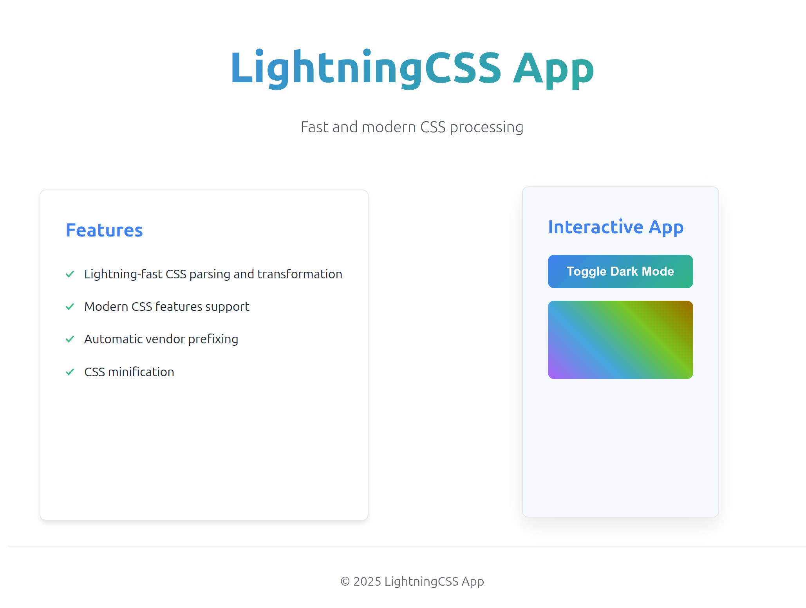
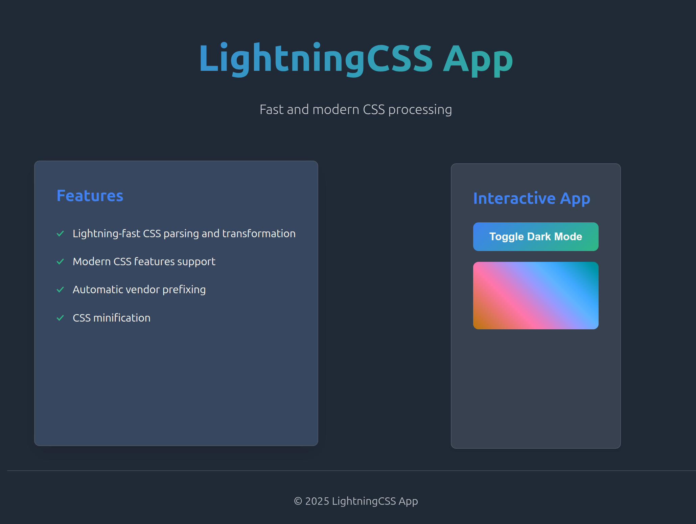

# LightningCSS

is a fast and modern CSS processing library that leverages the power of the latest CSS features to optimize and transform stylesheets written in Rust.

https://lightningcss.dev/

## Results

Light Mode  

Dark Mode  

