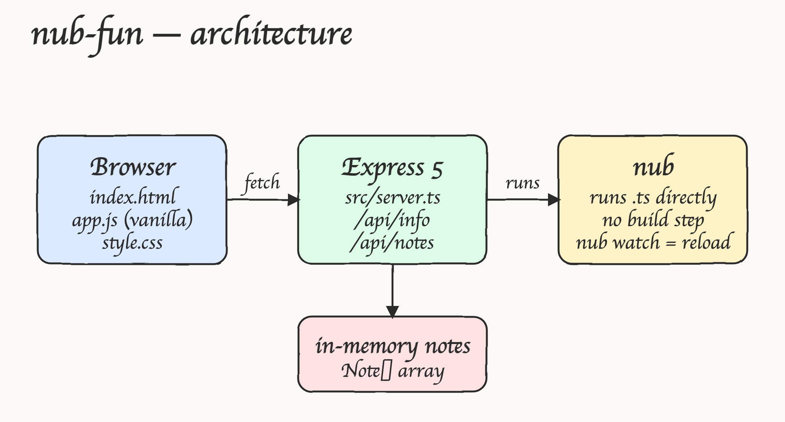
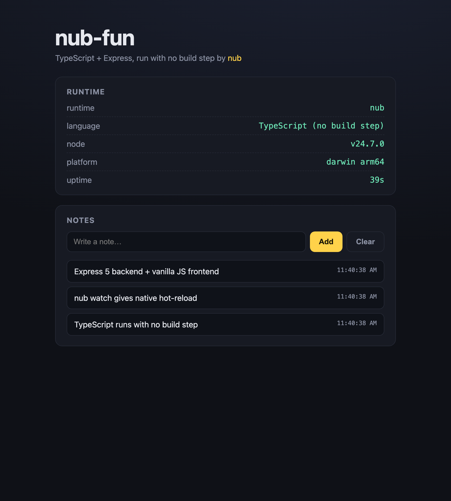

# nub-fun

A tiny POC that runs a **TypeScript + Express** app with **[nub](https://github.com/nubjs/nub)** — no build step, no `tsc`, no `tsx`. The backend is `src/server.ts`, run directly by nub; the frontend is plain HTML/CSS/JS served by Express.

## What is nub (and why it's the star here)

nub is a Rust CLI that augments stock Node.js with a Bun-like DX — it does **not** replace Node and adds no vendor APIs. In this POC nub is what makes the project tick:

| What we do | The nub command | Replaces |
|---|---|---|
| Run the TypeScript server with no build | `nub src/server.ts` | `node` + `tsc` / `tsx` / `ts-node` |
| Hot-reload in dev | `nub watch src/server.ts` | `nodemon`, `node --watch` |
| Run package scripts | `nub run dev` | `npm run`, `pnpm run` |
| Install deps | `nub install` | `npm`, `pnpm` |

The `/api/info` endpoint reports the live runtime so you can see it: `runtime: nub`, `language: TypeScript (no build step)`. There is **no `dist/`, no compile step** — nub transpiles `.ts` in-process (it embeds [oxc](https://oxc.rs/)).

## Architecture



## Screenshot



## Project layout

```
nub-fun/
  src/
    server.ts          Express 5 backend (TypeScript, run by nub)
    public/
      index.html       frontend markup
      style.css        styling
      app.js           frontend logic (fetch the API)
  package.json         scripts use nub; nub is a devDependency
  tsconfig.json
  start.sh / stop.sh / test.sh
```

## Prerequisites

nub. Install it globally (recommended):

```sh
curl -fsSL https://nubjs.com/install.sh | bash
# or: brew install nubjs/tap/nub
# or: npm install -g --ignore-scripts=false @nubjs/nub
```

If `nub` isn't on your `PATH`, `start.sh` falls back to the project-local copy in `node_modules/.bin/nub` (it's listed as a devDependency), so a plain `./start.sh` works out of the box.

## Run

```sh
./start.sh        # installs deps if needed, starts nub src/server.ts, waits for health
./test.sh         # exercises the API endpoints
./stop.sh         # stops the server
```

Open http://localhost:3000.

The port is configurable: `PORT=3100 ./start.sh`.

> Note: if port 3000 is already taken by another process, start on a different port with `PORT=<n> ./start.sh`.

### Dev / hot-reload

```sh
nub watch src/server.ts
```

## API

| Method | Path | Description |
|---|---|---|
| GET | `/api/info` | Runtime info (runtime, node version, platform, uptime) |
| GET | `/api/notes` | List notes (newest first) |
| POST | `/api/notes` | Add a note `{ "text": "..." }` |
| DELETE | `/api/notes` | Clear all notes |

Notes are kept in memory, so they reset when the server restarts.

## Verified

Run with nub `v0.2.5` on Node `v24.7.0`. Output of `./test.sh`:

```
GET /api/info   -> 200 {"runtime":"nub","language":"TypeScript (no build step)","node":"v24.7.0","platform":"darwin arm64",...}
POST /api/notes -> 201 {"id":1,"text":"hello from nub","at":"..."}
POST /api/notes -> 400 {"error":"text is required"}   (empty text rejected)
GET /api/notes  -> 200 [ ...newest first... ]
DELETE /api/notes -> status=204
All checks passed
```
