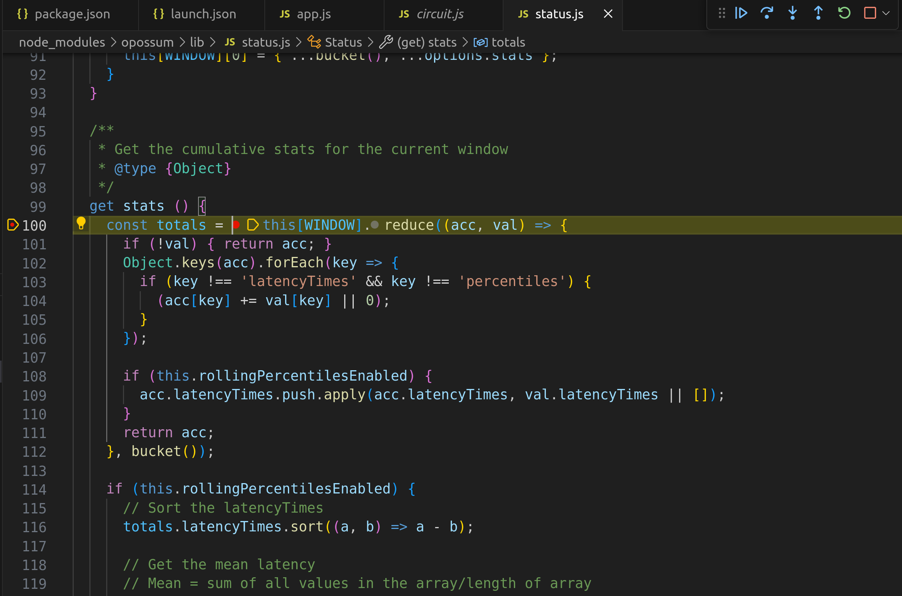
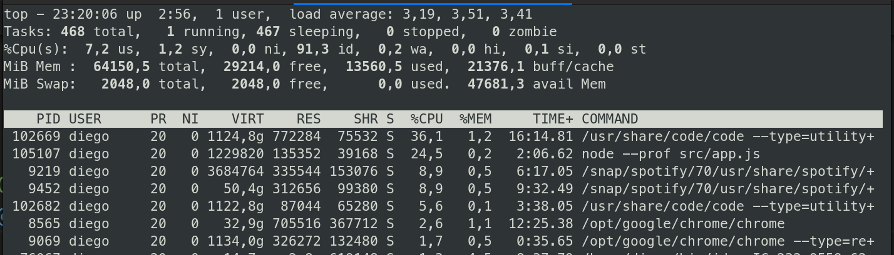
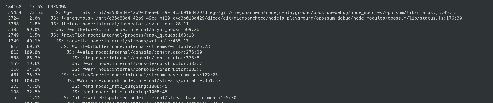

### How to run

There are two scenarios here, the uncivilized('/') and the civilized('/civilized').
```
uncivilized('/'): Never shutdown the circuitr breaker, so has some background things like (getStats) running.
civilized('/civilized'): Shutdowns the circuitr breaker
```
The circuit breakers are being created for every single call.


uncivilized('/')
1. run the server in "uncivilized mode" call the endpoint that never properly shutdown the circuit breaker.
2. run `npm run profile`
3. in a different terminal run `npm run stress` (doing 12x) so you have 12k requests
4. get the summary `npm run summary` check the file processed.txt

civilized('/civilized')
1. run the server in "civilized mode" call the endpoint that never properly shutdown the circuit breaker.
2. run `npm run profile`
3. in a different terminal run `npm run stress_civilized` (doing 12x) so you have 12k requests
4. get the summary `npm run summary` check the file processed.txt

### Results

Uncivilized
```
Testing v8 version different from logging version
Statistical profiling result from isolate-0x564f260-91409-v8.log, (23538 ticks, 9 unaccounted, 0 excluded).

 [Shared libraries]:
   ticks  total  nonlib   name
   8669   36.8%          /home/diego/.nvm/versions/node/v18.15.0/bin/node
    277    1.2%          /usr/lib/x86_64-linux-gnu/libc.so.6
     16    0.1%          [vdso]
      8    0.0%          /usr/lib/x86_64-linux-gnu/libstdc++.so.6.0.30

 [JavaScript]:
   ticks  total  nonlib   name
    775    3.3%    5.3%  LazyCompile: *get stats /mnt/e35d88d4-42b9-49ea-bf29-c4c3b018d429/diego/git/diegopacheco/nodejs-playground/opossum-debug/node_modules/opossum/lib/status.js:99:13
     88    0.4%    0.6%  LazyCompile: *listOnTimeout node:internal/timers:517:25
     62    0.3%    0.4%  LazyCompile: *<anonymous> /mnt/e35d88d4-42b9-49ea-bf29-c4c3b018d429/diego/git/diegopacheco/nodejs-playground/opossum-debug/node_modules/opossum/lib/status.js:176:30
     26    0.1%    0.2%  LazyCompile: *<anonymous> /mnt/e35d88d4-42b9-49ea-bf29-c4c3b018d429/diego/git/diegopacheco/nodejs-playground/opossum-debug/node_modules/opossum/lib/status.js:84:7
     25    0.1%    0.2%  LazyCompile: *Status /mnt/e35d88d4-42b9-49ea-bf29-c4c3b018d429/diego/git/diegopacheco/nodejs-playground/opossum-debug/node_modules/opossum/lib/status.js:51:15
     20    0.1%    0.1%  LazyCompile: *Socket._writeGeneric node:net:899:42
```

Civilized
```
Testing v8 version different from logging version
Statistical profiling result from isolate-0x729b260-93391-v8.log, (8780 ticks, 9 unaccounted, 0 excluded).

 [Shared libraries]:
   ticks  total  nonlib   name
   5040   57.4%          /home/diego/.nvm/versions/node/v18.15.0/bin/node
    183    2.1%          /usr/lib/x86_64-linux-gnu/libc.so.6
      8    0.1%          [vdso]
      3    0.0%          /usr/lib/x86_64-linux-gnu/libstdc++.so.6.0.30

 [JavaScript]:
   ticks  total  nonlib   name
     23    0.3%    0.6%  LazyCompile: *get stats /mnt/e35d88d4-42b9-49ea-bf29-c4c3b018d429/diego/git/diegopacheco/nodejs-playground/opossum-debug/node_modules/opossum/lib/status.js:99:13
     21    0.2%    0.6%  LazyCompile: *Status /mnt/e35d88d4-42b9-49ea-bf29-c4c3b018d429/diego/git/diegopacheco/nodejs-playground/opossum-debug/node_modules/opossum/lib/status.js:51:15
     16    0.2%    0.5%  LazyCompile: *Socket._writeGeneric node:net:899:42
     15    0.2%    0.4%  LazyCompile: *next /mnt/e35d88d4-42b9-49ea-bf29-c4c3b018d429/diego/git/diegopacheco/nodejs-playground/opossum-debug/node_modules/express/lib/router/index.js:177:16
```     

I added and stop the break point time to time, and is always running "getStats"
</img>

CPU never went down. Even when I stop sending requests, because getStats keep running.
</img>

V8 Profiler points to the same conclusion <BR>
</img>

### Some other metrics

http://localhost:8080/heap
```json
// 20231117190752
// http://localhost:8080/heap
{
  "total_heap_size": 13660160,
  "total_heap_size_executable": 786432,
  "total_physical_size": 14057472,
  "total_available_size": 4334141312,
  "used_heap_size": 10870080,
  "heap_size_limit": 4345298944,
  "malloced_memory": 516272,
  "peak_malloced_memory": 1080600,
  "does_zap_garbage": 0,
  "number_of_native_contexts": 1,
  "number_of_detached_contexts": 0,
  "total_global_handles_size": 16384,
  "used_global_handles_size": 10368,
  "external_memory": 829215
}
```

### Interesting Flags

Nodejs has some interesting flags can help us to figureout memory leaks and possible reasons to app to crash.

1) Detect sync io (can make node crash)
```bash
node --trace-sync-io src/app.js
```
2) Look for promisse rejections (can make memory leaks)
```bash
node --unhandled-rejections=warn src/app.js
```
3) More detail stack traces
```
NODE_DEBUG=fs node src/app.js
```

### Some notes on the profiler

Node Optimizations:

Means that node was able to optimize the code, if there is no * means your code 
is not optimized and can take more time than you realize
```
LazyCompile *something some.js 
```

### The V8 Inspector

1. run `node --inspect-brk src/app.js` 
2. goto chrome in: `about:inspect`
3. attach to the process, something like this: `ws://127.0.0.1:9229/4d5d22e3-b5dd-4e4d-8d84-d8f3a265b7b1`
4. have fun :-)

### Heapdump and load on the inspector

1. install npm instal heapdump --save
2. Add the head-dump endpoint in express
```js
app.get('/heap-dump', (req, res) => {
    var heapdump = require('heapdump');
    var filename = '/' + Date.now() + '.heapsnapshot';
    heapdump.writeSnapshot(filename);
    heapdump.writeSnapshot(function (err, filename) {
        console.log('dump written to', filename);
    });
    res.send(filename + " written!");
});
```
3. load in Chrome with - (A) run the app with node --inspect src/app.js
4. Goto chrome and type: about:inspect
5. Load the headump file in the Chrome V8 Inspector tool