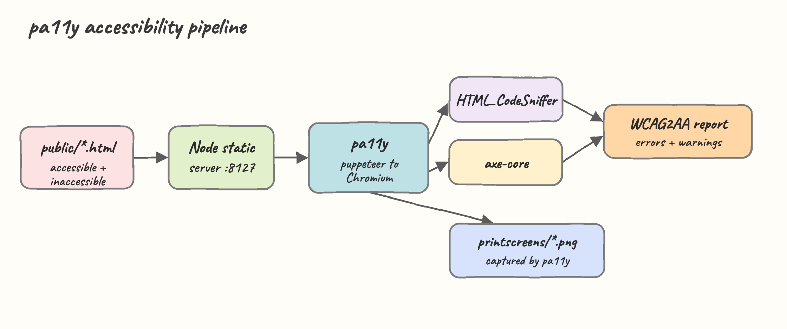
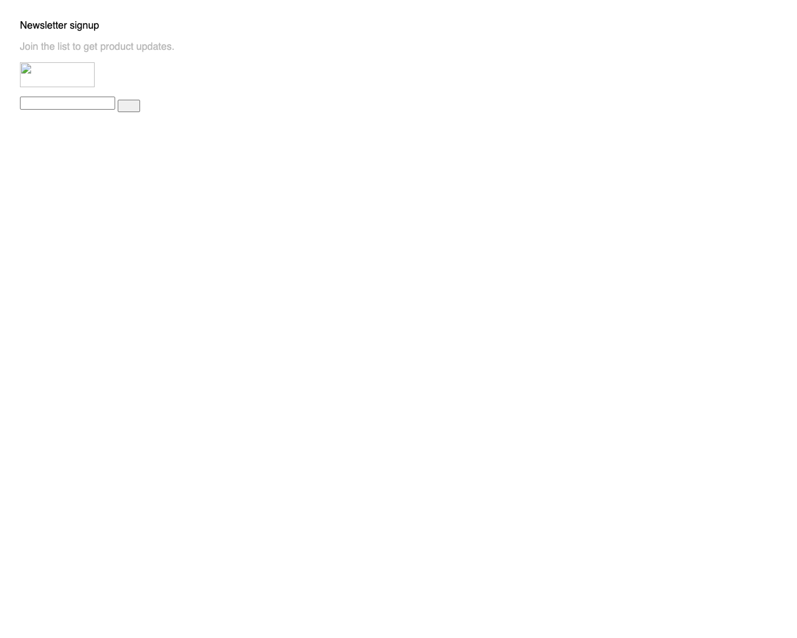

# pa11y accessibility testing POC

Accessibility testing with [pa11y](https://github.com/pa11y/pa11y) 9 and TypeScript 6.

[pa11y](https://github.com/pa11y/pa11y) drives a headless Chromium (through puppeteer) against a page and runs two
accessibility engines over the rendered DOM: **HTML_CodeSniffer** and **axe-core**. This POC serves two local pages — one
written accessibly, one full of common mistakes — checks both against **WCAG 2.1 AA**, and asserts that the accessible page
is clean while the broken one is flagged. pa11y also captures a screenshot of each page on the way through.



## What gets checked

Both engines run on every page with the `WCAG2AA` standard:

| Engine | What it is |
| --- | --- |
| HTML_CodeSniffer | Static rule set mapped directly to WCAG success criteria. |
| axe-core | Deque's engine, checks the live DOM and computed styles (contrast, ARIA names, landmarks). |

Issues come back typed as `error`, `warning` or `notice`. The runner fails only on `error`.

## Layout

```
src/server.ts   Zero-dependency static file server (Node http) for ./public
src/runner.ts   Starts the server, runs pa11y on each page, prints a report, exits 0/1
src/pa11y.d.ts  Local type declarations for the subset of the pa11y API used here
public/         The two pages under test
printscreens/   Screenshots captured by pa11y (screenCapture option)
```

The only runtime dependency is `pa11y`. TypeScript and `@types/node` are dev-only.

## Run

```bash
./run.sh
```

That installs dependencies on first run, compiles with `tsc`, and runs the test. To run the steps yourself:

```bash
npm install
npm run build
npm test
```

`npm test` exits `0` when every page matches its expectation (accessible page has no errors, broken page has errors) and
`1` otherwise, so it drops straight into a CI step.

## Output

```
Accessible page -> accessible.html
  title: Accessible Signup
  issues: none
  expectation: no errors -> PASS

Inaccessible page -> inaccessible.html
  title: (missing)
  issues: 16 error, 6 warning
  [error] WCAG2AA.Principle3.Guideline3_1.3_1_1.H57.2 (htmlcs)
    The html element should have a lang or xml:lang attribute which describes the language of the document.
    selector: html
  [error] image-alt (axe)
    Images must have alternative text
    selector: html > body > img
  [error] label (axe)
    Form elements must have labels
    selector: html > body > form > input
  ... 13 more errors ...
  expectation: errors present -> PASS

All accessibility checks met expectations.
```

The broken page trips both engines on the missing `lang`, the missing document title, the image with no `alt`, the unlabelled
input, the empty button and link, and the low-contrast paragraph.

## The two pages

`public/accessible.html` — a heading, an image with `alt`, a `label` tied to its input, a button and link with real text.


`public/inaccessible.html` — the same content stripped of its accessibility: no heading, a broken image with no `alt`, an
unlabelled field, an empty button, an empty link, and grey-on-white text below the contrast threshold.



## Testing your own pages

Add an HTML file to `public/` and a target to the `targets` array in `src/runner.ts`. To check a live site instead of the
local pages, drop the server and pass a real URL to `pa11y(...)` — everything else stays the same.
