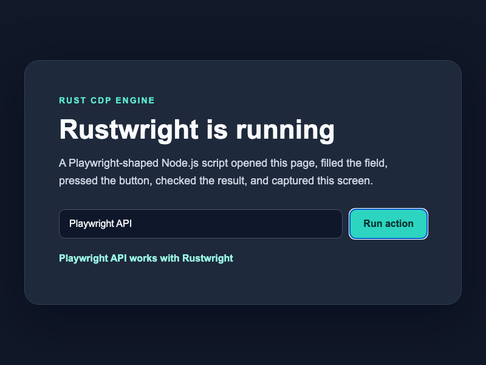
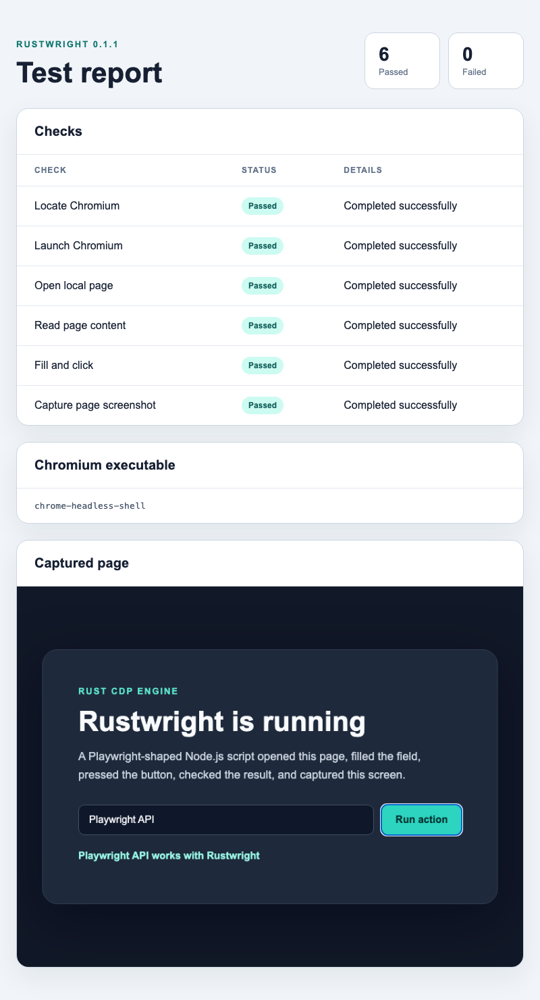

# Rustwright Node.js POC

A small browser automation proof of concept built with [Rustwright](https://github.com/Skyvern-AI/rustwright). The script uses a Playwright-shaped API backed by Rustwright's in-process Rust Chrome DevTools Protocol engine.

## What it does

`rustwright.js` launches Chromium in headless mode and opens a self-contained local page through a `data:` URL. It then:

1. Finds a local Chromium executable.
2. Launches Chromium through Rustwright.
3. Opens the local page and checks its title.
4. Reads page content.
5. Fills a field and presses a button.
6. Checks the updated text.
7. Captures the final browser page.
8. Builds an HTML test report and captures it.

The browser flow makes no network request. Network access is only needed when npm installs Rustwright for the first time.

## Architecture

```text
rustwright.js -> Rustwright Node binding -> Rust CDP engine -> Chromium
                                      |
                                      -> reports/index.html
                                      -> reports/automation.png
                                      -> reports/report.png
```

Rustwright talks directly to Chromium over CDP. It does not start the Playwright Node driver as a separate process.

## Requirements

- Node.js with npm
- Google Chrome or Chromium
- macOS or Linux for `ui.sh`

Rustwright's Node package does not download a browser. It discovers an installed browser or reads one of these environment variables:

```bash
RUSTWRIGHT_CHROMIUM=/path/to/chromium ./run.sh
CHROME=/path/to/chrome ./run.sh
CHROMIUM=/path/to/chromium ./run.sh
```

## Run

```bash
./run.sh
```

The first run installs the dependency from `package-lock.json`. Later runs reuse the local installation.

Successful output:

```text
PASS Locate Chromium
PASS Launch Chromium
PASS Open local page
PASS Read page content
PASS Fill and click
PASS Capture page screenshot
6 passed, 0 failed
Report: /path/to/rustwright-fun/reports/index.html
```

## Open the report

```bash
./ui.sh
```

If the report does not exist, `ui.sh` runs the browser checks first. It opens `reports/index.html` with `open` on macOS or `xdg-open` on Linux.

## Browser result



## HTML report



## Files

| File | Purpose |
| --- | --- |
| `rustwright.js` | Playwright-shaped browser flow, checks, screenshots, and report generation |
| `run.sh` | Installs the locked dependency when needed and runs the checks |
| `ui.sh` | Opens the generated HTML report |
| `package.json` | Pins Rustwright 0.1.1 |
| `package-lock.json` | Locks the npm installation |
| `docs/automation.png` | Captured automated page used by this README |
| `docs/report.png` | Captured HTML report used by this README |

The `reports/` directory is generated by `run.sh` and excluded from Git.

## Current Rustwright scope

Rustwright is currently alpha software and supports Chromium only. Its Node.js binding covers a smaller API surface than its Python binding. This POC stays within the supported Node methods: `launch`, `newPage`, `goto`, `title`, `textContent`, `fill`, `click`, `screenshot`, and `close`.

See the upstream [Node.js guide](https://github.com/Skyvern-AI/rustwright/blob/main/node/README.md) and [limitations](https://github.com/Skyvern-AI/rustwright/blob/main/LIMITATIONS.md) before using it for a larger automation suite.
