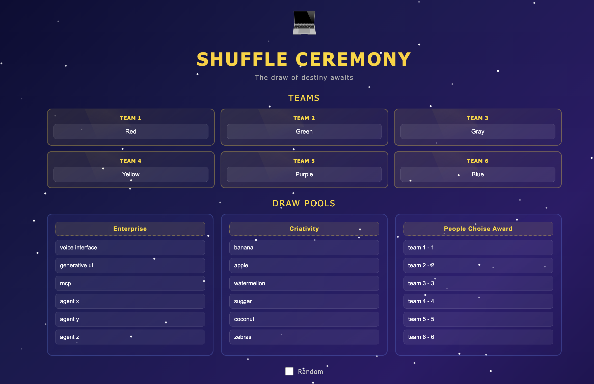
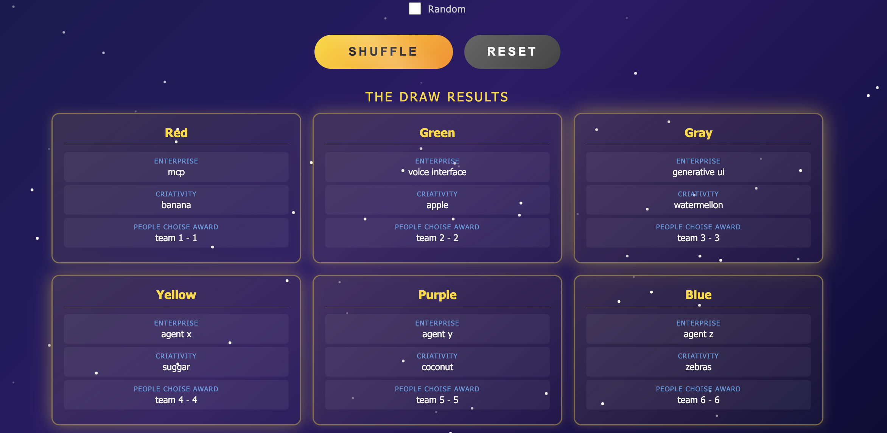

### Shuffle Ceremony

A web-based shuffle ceremony app for distributing items across teams. Built with plain HTML, CSS and JS in a single file.

#### Features

* 6 team slots with custom names
* 3 draw pools with 6 items each and editable labels
* Random checkbox controls the 3rd pool (Pot C) distribution - checked shuffles randomly, unchecked assigns in order (1-to-1 with teams left to right)
* Pot A and Pot B are always shuffled randomly
* Animated shuffle ceremony with confetti, spinning overlay and card reveal animations
* Reset button clears results without losing any input data
* All inputs are saved to localStorage automatically and restored on page reload

#### How to run
```
./run.sh
```

### Result




