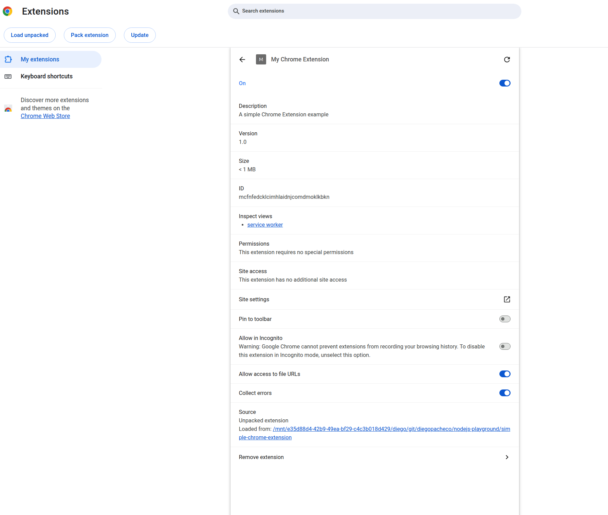
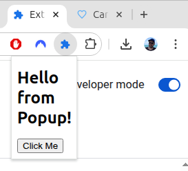
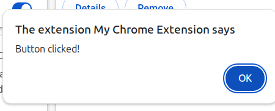

### Install

Load it into Chrome via: `chrome://extensions` 
enable Developer Mode click on `"Load unpacked"`

### Result

After installed - when click in extension details:  

Extension in Chorme:  

When click on the button:  
