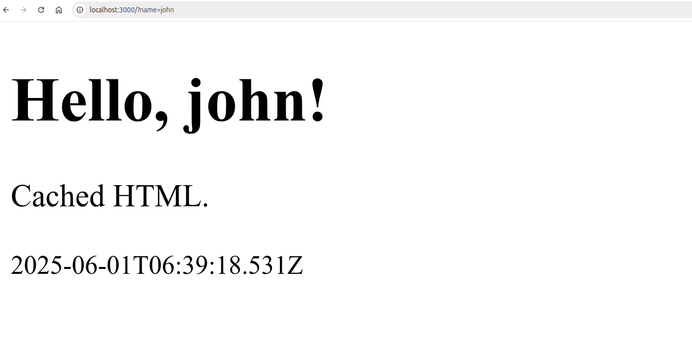

# Simple SSR 

Simple NodeJS Server Side Rendering (SSR) without any framework.

### Run

```bash
npm run start
```

### Result

```
❯ npm run start

> simple-server-side-rendering@1.0.0 start
> node src/server.js

Server with LRU cache running at http://localhost:3000/
Rendered and cached for "john"
Cache hit for "john"
Cache hit for "john"
Cache hit for "john"
Cache hit for "john"
Rendered and cached for "mary"
Rendered and cached for "peter"
Rendered and cached for "paul"
Cache hit for "john"
Rendered and cached for "adam"
Rendered and cached for "eve"
Cache hit for "john"
Rendered and cached for "max"
Rendered and cached for "xxx"
Rendered and cached for "zzz"
Rendered and cached for "www"
Rendered and cached for "diego"
Rendered and cached for "john"
Cache hit for "xxx"
Cache hit for "john"
```

