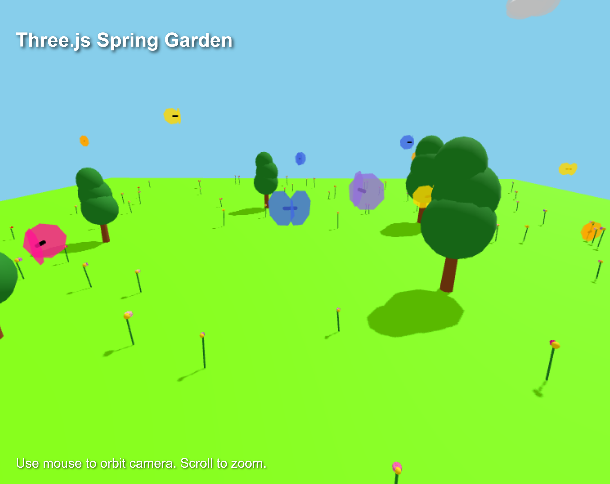

# Three.js Spring Garden

This project is a Three.js application that simulates a vibrant spring garden filled with trees, blooming flowers, and animated elements. The goal is to create an immersive experience that showcases the beauty of nature during springtime.



## Features

- A dynamic Three.js scene with realistic trees and flowers.
- Animation effects that simulate blooming flowers and swaying trees.
- Customizable properties for trees and flowers, allowing for diverse appearances.
- Responsive design that adapts to different screen sizes.

## Getting Started

To get started with the Three.js Spring Garden project, follow these steps:

1. **Clone the repository:**
   ```bash
   git clone <repository-url>
   cd three-js-spring-garden
   ```

2. **Install dependencies:**
   Make sure you have Node.js installed. Then run:
   ```bash
   npm install
   ```

3. **Run the application:**
   You can start the application using:
   ```bash
   npm start
   ```
   This will launch a local server and open the application in your default web browser.

## Project Structure

- `src/`: Contains the source code for the application.
  - `index.js`: Entry point of the application.
  - `styles.css`: Styles for the application.
  - `components/`: Contains components for the scene, trees, flowers, and animations.
  - `utils/`: Utility functions for animations and helpers.
  - `textures/`: Directory for texture files.
  
- `public/`: Contains the main HTML file.
  - `index.html`: The HTML file that includes the canvas for rendering.

- `package.json`: Configuration file for npm.

## Acknowledgments

- This project utilizes Three.js for rendering 3D graphics.
- Special thanks to the contributors and the open-source community for their support and resources.

Feel free to explore and modify the project to create your own unique spring garden experience!