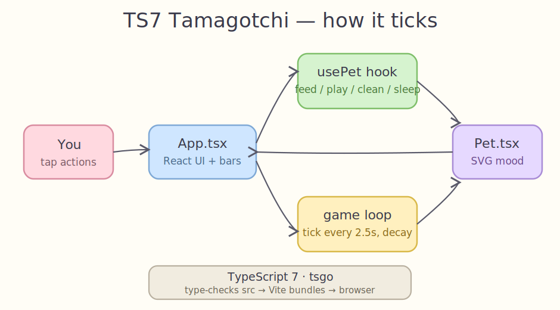
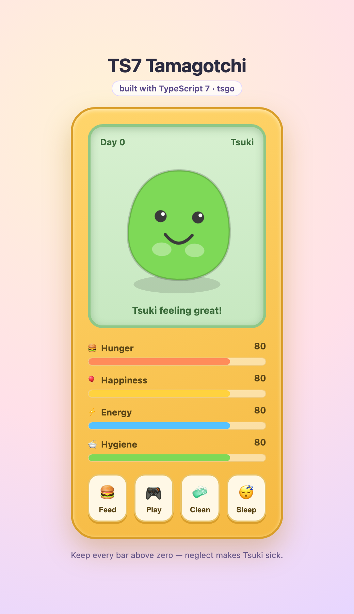
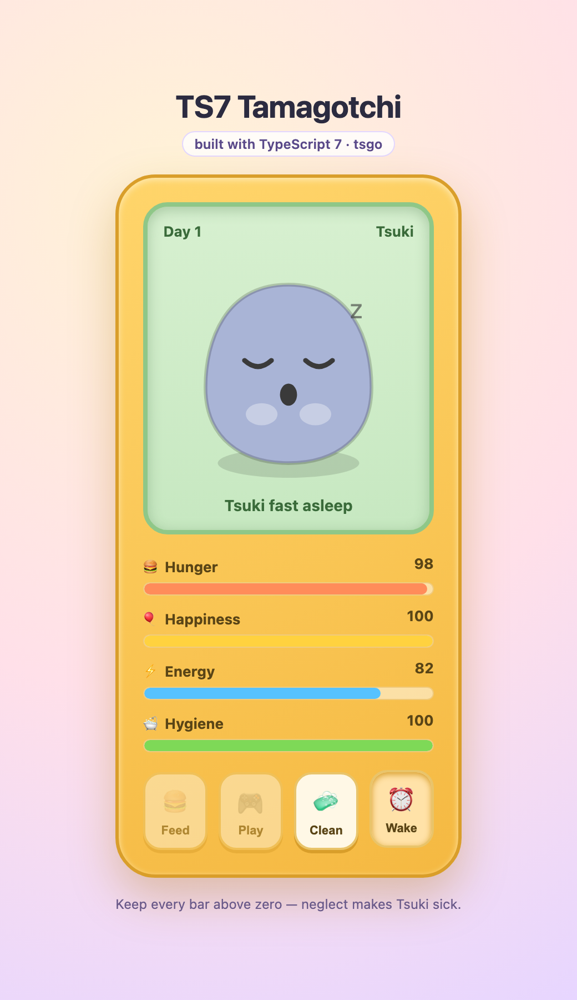

# TS7 Tamagotchi

A web Tamagotchi-like pet game built with **React** and **TypeScript 7** — the compiler [rewritten in Go](https://jatniel.dev/en/bytes/typescript-7-rc-the-compiler-rewritten-in-go-around-10x-faster) (`tsgo`, ~10x faster type-checking).

Take care of Tsuki: feed it, play with it, keep it clean, and let it sleep. Stats decay over time — let hunger or hygiene hit zero for too long and Tsuki gets sick and eventually dies.

## How it ticks



The `usePet` hook holds the pet state and runs a game loop on `setInterval`. Every 2.5s tick decays the stats; the action buttons in `App.tsx` push the stats back up; `Pet.tsx` renders the mood as an SVG face. TypeScript 7 (`tsgo`) type-checks the source, Vite bundles it.

## Screens

| Healthy | Asleep |
| --- | --- |
|  |  |

## Gameplay

- **Hunger / Happiness / Energy / Hygiene** — four stats, each 0–100, decaying every tick.
- **Feed** 🍔 raises hunger. **Play** 🎮 raises happiness but spends energy. **Clean** 🧼 raises hygiene. **Sleep** 😴 recovers energy (Feed and Play are disabled while asleep).
- When hunger or hygiene stays at zero for several ticks Tsuki gets sick; ignore it and it's game over — then hatch a new one.

## TypeScript 7

The project type-checks with the Go-based compiler from `@typescript/native-preview`:

```bash
npm run typecheck   # tsgo --noEmit
npx tsgo --version  # 7.0.0-dev...
```

`npm run build` runs `tsgo --noEmit` before the Vite production build.

## Run it

```bash
./start.sh   # installs deps if needed, serves on http://localhost:5180
./stop.sh    # stops the dev server
```

Or directly:

```bash
npm install
npm run dev
```

## Stack

- React 19 + TypeScript 7 (`@typescript/native-preview` / `tsgo`)
- Vite 8 dev server and bundler
- No game or UI libraries — plain React state and SVG/CSS
