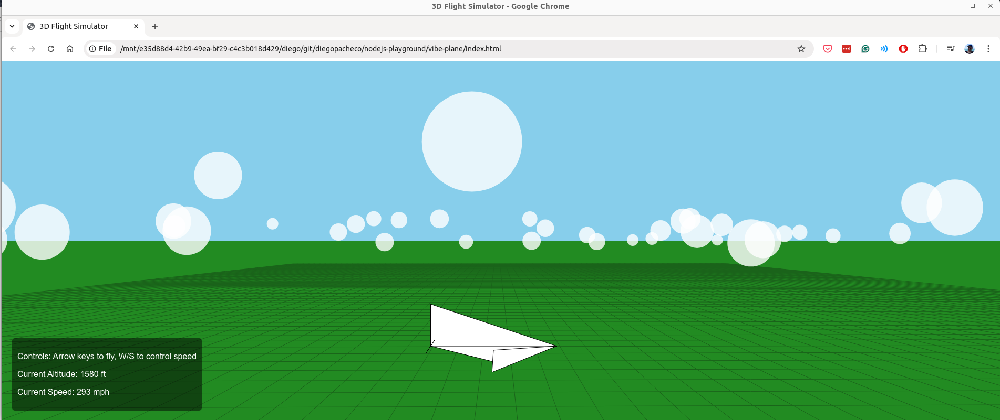

# Flight Simulator Game

## Description

This is a simple flight simulator game built using HTML and JavaScript. Players can control a plane using keyboard inputs to navigate through a basic environment. The game is designed to be straightforward and fun, providing a basic introduction to game development concepts.

## Features

- Control a plane using the keyboard (Arrow keys).
- Simple graphics and user interface.
- Basic collision detection with the environment.

## How to Run the Game

1. Clone the repository or download the project files.
2. Open the `index.html` file in a web browser.
3. Use the Arrow keys to control the plane and navigate through the environment.