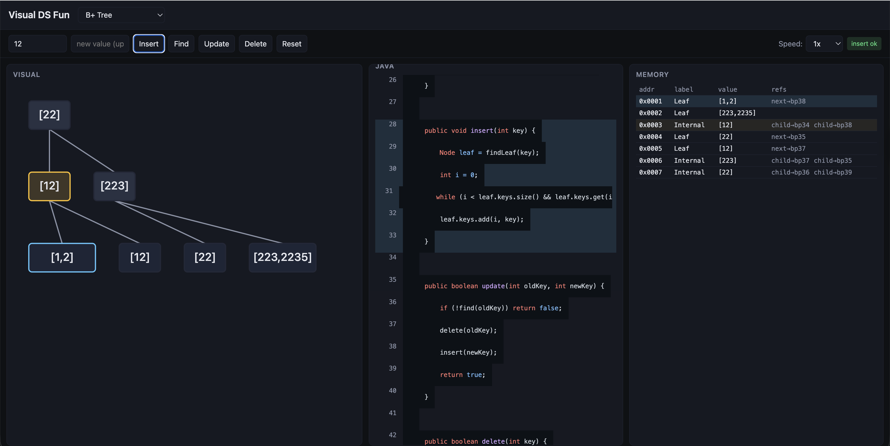

# Visual DS Fun

Interactive web app to **visualize data structures** side-by-side with their **Java implementation** and **runtime memory layout**. Pick a structure, run insert / find / update / delete, and watch the three views update in lockstep with animated highlights.



## What the screenshot shows

The snapshot above captures the app right after inserting key `12` into a **B+ Tree** (order 3). The three panes share the same operation event, so every change is correlated visually, structurally, and in code.

### Left — Visual
- A B+ Tree with two internal levels and four leaves at the bottom: `[1,2]`, `[12]`, `[22]`, `[223,2235]`.
- The internal node **`[12]`** is outlined in **amber** — it's on the **traversal path** the insert walked down to locate the target leaf.
- The leaf **`[1,2]`** is outlined in **cyan** — it's the **affected** node where the key was placed. The `pop` animation runs on this node; nodes on the path get the `pulse` animation.
- Edges are drawn between nodes; layout is computed top-down per level so the tree grows in height as splits promote keys upward.

### Middle — Java
- Authentic Java source for the structure, rendered with `highlight.js` (github-dark) and a left gutter with line numbers.
- The lines for the **active op** (`insert`) are tinted cyan — here lines ~28–33 (`public void insert(int key) { ... leaf.keys.add(i, key); }`).
- The pane auto-scrolls to bring the highlighted range into view when an op fires.

### Right — Memory
- A flat table representing each B+ Tree node as a **memory cell**: synthetic address (`0x0001`…), label (`Leaf` / `Internal`), the keys array, and the outgoing references (`child-bpN`, `next-bpN`).
- The row whose `id` matches `event.affected` is **highlighted cyan**; rows whose `id` is on `event.path` are **tinted amber**. So you can see exactly which class-fields-as-memory-slots changed.

### Top bar
- DS picker (currently **B+ Tree**) — switching it resets the workspace to an empty instance of that structure.
- Op input + new-value input, then **Insert / Find / Update / Delete / Reset**.
- **Speed** selector (0.5x / 1x / 2x).
- A status chip on the right — **`insert ok`** confirms the last operation succeeded.

## Supported data structures

- Doubly Linked List
- Stack
- Queue
- Binary Search Tree
- Trie
- Graph
- LSM Tree
- B+ Tree

Each one supports **insert / find / update / delete** (where the op is idiomatic — e.g. stack delete pops the top).

## Stack

- **Bun** (runtime) + **Vite** (bundler) + **React** + **TypeScript** (strict)
- **TanStack Store** for state
- **highlight.js** for Java syntax highlighting
- **Vitest** for tests
- SVG + CSS transitions for animations — no animation libraries

## Architecture

```
src/
  domain/    pure TS — DS implementations, no React or DOM
  memory/    DS state → memory cells
  java/      static Java source + op-to-line-range maps
  ui/        React components, TanStack store, per-DS canvases
```

Layering is one-way: `ui` → `memory`, `java`, `domain`. `domain` knows nothing about the rest.

## Run

```bash
./run.sh    # installs deps if missing, starts Vite dev server on :5173
./stop.sh   # stops the dev server
```

Then open <http://localhost:5173/>.

## Other scripts

```bash
bun run typecheck   # tsc -b --noEmit
bun run test        # vitest run
bun run build       # production build to dist/
```

## Tests

Domain modules are unit-tested with Vitest. Tests encode *why* a behavior matters, not just shape — e.g. *"deleting head of DLL must re-link prev=null on new head so traversal terminates"*.

```
Test Files  6 passed (6)
     Tests  11 passed (11)
```

## Design

See [`design-doc.md`](./design-doc.md) for the full design — goals, scope, layering rules, visualization constraints, and MVP plan.
